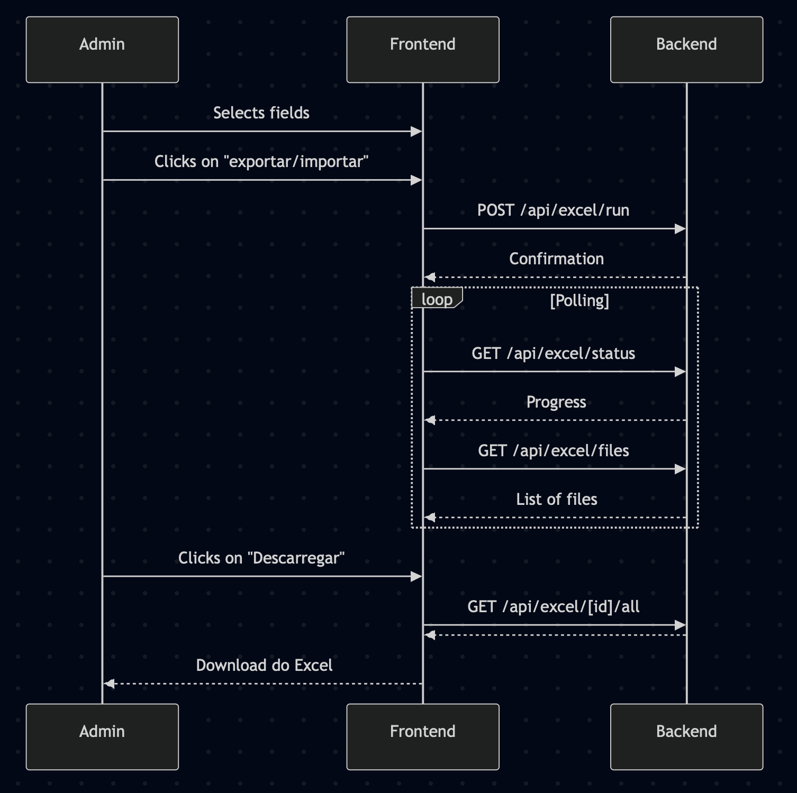

# Analysis and Design 

This document outlines the architecture and planned enhancements for key administrative interfaces of the Juris system—focusing on the "Editar Acórdão" and "Exportar/Importar" pages. It includes an overview of current implementations, communication flows, and a structured roadmap for future improvements.

## **Main Technologies**

- **React** (with Next.js for routing and SSR)
- **TypeScript**
- **Context API** (for form state)
- **Custom hooks** (e.g., useFetch)

# Editing Page (Admin - Editar Acórdão)

## **Main Components & Structure**

This page lives under src/pages/editar/avancado/[id].tsx and uses a shared layout component (DashboardGenericPage) to maintain a consistent admin appearance. This ensures the page has the admin navigation/header, the user is authenticated and has access to field metadata and that he page is styled consistently with other admin dashboard pages.

 When the page loads, it fetches the document to be edited and dynamically renders input components such as TextInput, DateInput, and ShowCode based on the schema defined in the dashboardDoc module. The fields to be displayed are determined via useKeysFromContext, which interprets the structure of the document and the editing context.

- **Page file:** src/pages/editar/avancado/[id].tsx
- **Layout:** Uses DashboardGenericPage for consistent admin look.
- **Data Fetching:** Uses useFetch to get the document data from /api/doc/[id].
- **Form State:** Uses UpdateContext (React Context) to manage changes before saving.
- **Field Editors:** Dynamically renders field editors based on the document schema:
- TextInput, DateInput, ExactInput, GenericInput, ShowCode, etc. (from @/components/dashboardDoc)
- **Field Metadata:** Uses useKeysFromContext to know which fields exist and how to render them.
- **Actions:** Save, Cancel, Delete  buttons, which trigger API calls.

## **API Communication**

- **GET /api/doc/[id]**: Fetches the document to edit.
- **PUT /api/doc/[id]**: Saves changes (sends updated fields as JSON).
- **DELETE /api/doc/[id]**: Deletes the document.

**Data Flow:**
1. Page loads, fetches document via useFetch.
1. User edits fields; changes are stored in UpdateContext.
1. On save, sends a PUT request with the changed fields.
1. On delete, sends a DELETE request.

# Export & Import page (Admin - Editar Acórdão)

## **Main Components & Structure**

Main Components & Structure
Page file: src/pages/admin/excel/index.tsx
Layout: Uses DashboardGenericPage.
Field Selection: Renders checkboxes for each exportable field (from @/components/exportable-keys).
File Upload: <input type="file" /> for importing Excel files.
Progress Bars: Show status of import/export operations.
Action Buttons: "Atualizar" (import), "Nova exportação" (export).
Export History Table: Lists previous exports/imports, with download links.
RowFile/CellFile: Components for rendering each row/cell in the history table.

## **API Communication**

- **GET /api/excel/status**: Fetches current progress of import/export.
- **GET /api/excel/files**: Fetches list of available export/import files.
- **POST /api/excel/run**: Triggers an export or import operation.

For import: sends a FormData with the file.

For export: sends selected fields as query params.

- **GET /api/excel/[id]/[link]**: Downloads a specific file (exported Excel, aggregation, etc).

**Data Flow:**

1. Page loads, fetches status and file list via useFetch.
2. User selects fields and uploads a file or requests export.
3. On action, sends a POST to /api/excel/run.
4. Progress bars update via polling /api/excel/status.
5. Table updates via polling /api/excel/files.
6. User can download files via links.

### Here is a sequence diagram portraying the Export page:

# Data Related Enhancements – Feature Overview & Implementation Plan

To increase the utility of the Export page, a set of analytical and interactive enhancements will be introduced. With added analytics and administrative filtering, it will evolve into a diagnostic and quality assurance dashboard for managing the Juris dataset.

### Data Totals Over Time

The first planned feature is a dashboard that allows users to visualize how certain records evolve over time filtering by their metadata fields, time period and other nuances.

- Objective: Display total records and new records since a selected date.
- Backend: API endpoint (`/api/analytics/created-over-time`) providing counts grouped by creation date (daily, weekly, monthly).
- Frontend: Date picker and chart (bar or line) visualizing totals and new entries.
- UI Placement: Top of the Export page, above export/import controls.

---

### Rare Value Insights

Another planned enhancement is a tool to surface rare or uncommon metadata entries that can possibly be data normalization issues or interesting insights.
- Objective: Identify uncommon or specific attribute values 
- Backend: API endpoint (`/api/analytics/rare-values?field=Tipo`) returning sorted value counts.
- Frontend: Attribute selector (dropdown) with chart or list of rare values.
- UI Placement: Below or beside the time-based chart.

---

### Advanced Data Filtering

To improve data diagnostics, an advanced filtering panel will be added. This will resemble the public-facing search UI but expose additional filters only available to admins. These components will be placed directly above the results table and connected to extended versions of existing search APIs.

- Objective: Enable admin-level filtering and search functionality.
- Frontend: Extend existing search/filter components with additional fields.
- Backend: Use or extend current search APIs with admin-only filters.
- UI Placement: Above the data table, as a search/filter toolbar.

---

### Inline Record Editing

- Objective: Edit records directly from the data table.
- Status: Already implemented via “Edit” button on each table row.

---

### Filtered Excel Export

Next, an "Export to Excel" feature will be introduced that respects the currently active filters. When triggered, it sends these filters to the backend, which returns an Excel file containing only the relevant data. This button will be situated near the search filters or just above the results table.

- Objective: Export data based on active filters/view.
- Frontend: “Export to Excel” button submitting current filters.
- Backend: Endpoint generating filtered Excel output.
- UI Placement: Near filters or above the results table.

---

### Post-Upload Analysis Report

Finally, after an Excel import operation, the page should now display a comprehensive analysis report of the changes the import brings into the database.

- Objective: Summarize updates made after Excel import.
- Backend: Report generated during import (new entries, updates, errors).
- Frontend: Display report in a modal or side panel post-upload.

